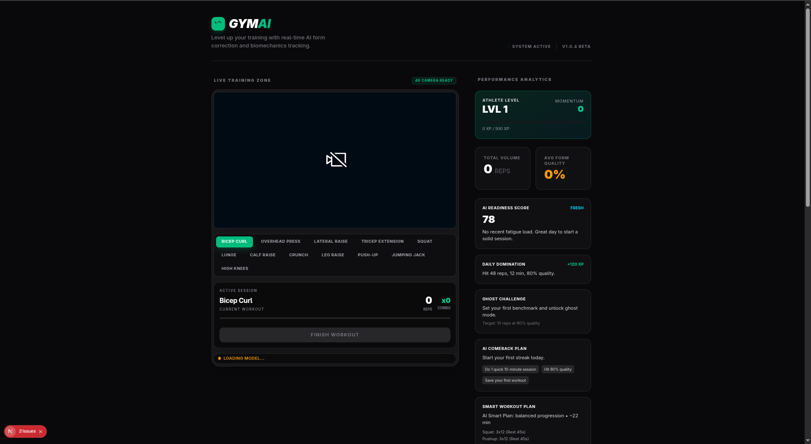

<p align="center">
  
</p>

<h1 align="center">🏋️ GymAI — AI Gym Trainer</h1>

<p align="center">
  <strong>Real-time AI form correction and biomechanics tracking for home workouts.</strong><br />
  Watch your webcam, get a rep counter, live form feedback, and a full gamified training dashboard — all running in the browser.
</p>

<p align="center">
  
  
  
  
  
</p>

---

## 🧠 What is this?

GymAI is a **full-stack AI personal trainer** that uses your webcam to analyze your exercise form in real time. It's like having a coach watch every rep you do — it counts reps automatically, detects bad form (swinging, leaning, partial reps, knee cave, sagging hips, and more), and gives instant corrections with a live skeleton overlay.

The entire computer-vision pipeline runs **locally in your browser** using Google's MediaPipe BlazePose — no video ever leaves your machine. A Node.js/Express + PostgreSQL backend stores your workout sessions and powers a gamified analytics dashboard (XP, levels, streaks, achievements, ghost challenges, leaderboards, and AI-generated workout plans).

## ✨ Features

### Real-Time Pose Engine
- **33-point full-body landmark tracking** via MediaPipe BlazePose (model complexity 1, smooth landmarks enabled)
- Live **skeleton overlay** + per-joint angle readouts drawn directly on the video canvas
- **Automatic rep counting** via a threshold state machine (`down` ↔ `up`) with noise-tolerant hysteresis
- **Form correction engine** — per-exercise rules that fire warnings and errors, e.g.:
  - Bicep curl: "Stop swinging! Pin elbows!", "Curl higher!"
  - Squat: "Knees out! Don't cave in!", "Chest up! Don't lean forward!"
  - Push-up: "Don't sag hips! Tighten core!", "Go chest to floor!"
- **Visibility guard** — prompts you to step back if the full body isn't in frame
- **Progress gauge** drawn around the active joint showing range-of-motion completion
- **Combo/momentum system** with hype messages every 3 and 5 reps

### Supported Exercises (12)
| Upper Body | Lower Body | Core | Full Body |
|---|---|---|---|
| Bicep Curl | Squat | Crunch | Push-Up |
| Overhead Press | Lunge | Leg Raise | Jumping Jack |
| Lateral Raise | Calf Raise | | High Knees |
| Tricep Extension | | | |

### Biomechanics Engine (`src/lib/biomechanics.ts`)
- 2D and 3D joint-angle calculation (`atan2`-based and vector-dot-product based)
- Torso lean detection, vertical alignment, symmetry ratio (left/right)
- Body orientation detection (front / side / back)
- Velocity tracking to catch jerky, uncontrolled movement
- Joint visibility validation helpers

### Gamified Growth Dashboard
- **XP + leveling system**, momentum score, current/longest streaks
- **Daily quests** (Rep Blitz, Show Up Time, Elite Form) and achievement track
- **AI Readiness Score** — tells you whether to push hard or recover, computed from recent training load
- **Ghost Challenge** — a personalized "beat your past self" target
- **Smart Workout Plan** generated from goal + history
- **Leaderboard**, weekly momentum bars, and full session history table

### Backend & Data
- Express REST API with modular routes: sessions, workout logs, personal records, coaching, growth
- PostgreSQL (Sequelize ORM), auto-synced schema
- AI-powered coaching and plan generation via Google Gemini

## 🏗️ How it's built

### Architecture
```
┌─────────────────────────────────────────────────────────────┐
│                        BROWSER (Next.js)                    │
│                                                             │
│  Webcam ──► MediaPipe BlazePose (CDN) ──► Landmarks         │
│                │                                            │
│                ▼                                            │
│  Biomechanics Engine ─► angle calc, lean, symmetry          │
│                │                                            │
│                ▼                                            │
│  Rep Counter State Machine ─► reps, progress, form errors   │
│                │                                            │
│                ▼                                            │
│  Canvas overlay + UI (feedback, hype, gauges)               │
│                │                                            │
│                ▼  POST /api/sessions  (fetch)               │
├───────────────────────────┼─────────────────────────────────┤
│                    EXPRESS API (port 5000)                  │
│  /api/sessions  /api/workout-logs  /api/personal-records    │
│  /api/coaching  /api/growth                                 │
│                │                                            │
│                ▼                                            │
│              PostgreSQL (Sequelize)                         │
└─────────────────────────────────────────────────────────────┘
```

### Tech Stack
| Layer | Technology |
|---|---|
| Frontend | Next.js 16 (App Router, Turbopack), React 19, TypeScript, Tailwind CSS 4 |
| Vision | MediaPipe Pose (BlazePose) + MediaPipe Drawing Utils via CDN |
| Backend | Node.js, Express 5, Sequelize ORM |
| Database | PostgreSQL |
| AI | Google Gemini (`@google/generative-ai`) for coaching/plans |
| Auth/Data | Supabase JS (configured, `@supabase/ssr` present) |
| Testing | Jest + ts-jest (frontend), Jest + Supertest (backend) |

### Key Design Decisions
1. **Privacy-first**: pose estimation runs entirely client-side; raw video never touches the network.
2. **Dynamic imports**: MediaPipe modules are imported dynamically at runtime to work around Turbopack build constraints.
3. **Generic rep engine**: one state machine (`updateExercise` in `repCounter.ts`) handles every exercise via declarative config (thresholds, required joints, form rules) — adding a new exercise is pure configuration.
4. **Config-driven exercises**: each exercise declares its angle function, form rules, difficulty, muscle groups, and coaching tips.
5. **Gamification as retention**: the obsession engine (`obsessionEngine.ts`) converts raw sessions into XP, streaks, and quests; the growth API layers readiness, ghost targets, and smart plans on top.

## 🚀 Getting Started

### Prerequisites
- Node.js 20+
- PostgreSQL running locally (or a remote `DATABASE_URL`)

### 1. Frontend
```bash
npm install
npm run dev
```
Open [http://localhost:3000](http://localhost:3000). Allow camera access — you'll need to be in a well-lit room with your full body in frame.

### 2. Backend
```bash
cd server
npm install
npm run dev   # or: npm start
```
The API runs on port 5000 and auto-creates its tables via `sequelize.sync()`.

### 3. Environment Variables

**Root `.env`** (frontend):
```env
NEXT_PUBLIC_API_URL=http://localhost:5000
NEXT_PUBLIC_SUPABASE_URL=<your-supabase-url>
NEXT_PUBLIC_SUPABASE_PUBLISHABLE_KEY=<your-supabase-key>
```

**`server/.env`** (backend):
```env
PORT=5000
GEMINI_API_KEY=<your-google-gemini-key>   # required for /api/coaching and smart plans
DATABASE_URL=                              # leave empty to use individual PG_* vars
PG_HOST=localhost
PG_PORT=5432
PG_DATABASE=postgres
PG_USER=postgres
PG_PASSWORD=<your-postgres-password>
PGSSLMODE=disable                          # set to 'require' for managed DBs (e.g. Supabase)
```

> ⚠️ Never commit real keys. The repo's `.gitignore` excludes `.env` files.

## 🧪 Testing

```bash
npm test                  # frontend (jest + ts-jest)
cd server && npm test     # backend (jest + supertest)
```

## 📡 API Overview

| Method | Endpoint | Description |
|---|---|---|
| POST | `/api/sessions` | Save a completed workout session |
| GET | `/api/sessions` | List sessions (filter by `?userId=`) |
| GET | `/api/sessions/achievements` | Achievement progress |
| GET | `/api/sessions/trends` | Weekly rep trends |
| — | `/api/workout-logs` | Structured workout logging |
| — | `/api/personal-records` | PR tracking |
| — | `/api/coaching` | AI coaching (Gemini) |
| GET | `/api/growth/daily-mission` | Daily mission with adaptive goals |
| GET | `/api/growth/readiness` | AI readiness score |
| GET | `/api/growth/ghost-target` | Beat-your-past-self challenge |
| GET | `/api/growth/comeback-plan` | Re-engagement plan for inactive users |
| GET | `/api/growth/leaderboard` | Reps/quality leaderboard |
| GET | `/api/growth/smart-plan?goal=` | AI-generated workout plan |
| GET | `/api/growth/monetization-signals` | Pro-offer conversion signals |
| GET | `/health` | Backend health check |

## 📁 Project Structure

```
├── src/
│   ├── app/                 # Next.js App Router (layout, home page)
│   ├── components/
│   │   ├── WebCamFeed.tsx   # Camera, pose pipeline, canvas overlay, rep logic
│   │   └── Dashboard.tsx    # Gamified analytics dashboard
│   └── lib/
│       ├── biomechanics.ts      # Angle/lean/symmetry/orientation math
│       ├── repCounter.ts        # Exercise registry + rep state machine
│       ├── obsessionEngine.ts   # XP, streaks, quests, levels
│       ├── workoutPrograms.ts   # Pre-built workout plans + session state machine
│       └── workoutTimer.ts      # Timer helpers
├── server/
│   ├── server.js            # Express entry point
│   ├── db/                  # Sequelize setup
│   ├── models/              # DB models
│   ├── routes/              # sessions, workoutLogs, personalRecords, coaching, growth
│   └── package.json
└── image.png                # Project banner
```

## 🔮 Roadmap Ideas
- User accounts (Supabase auth integration already configured)
- More exercises & program templates
- Per-set form scoring and personal records UI
- Mobile responsiveness pass for the training zone
- Workout program mode that chains exercises with rest timers

---

<p align="center">
  <sub>Built with Next.js, MediaPipe, Express, and a whole lot of reps. Stay consistent. 💪</sub>
</p>
